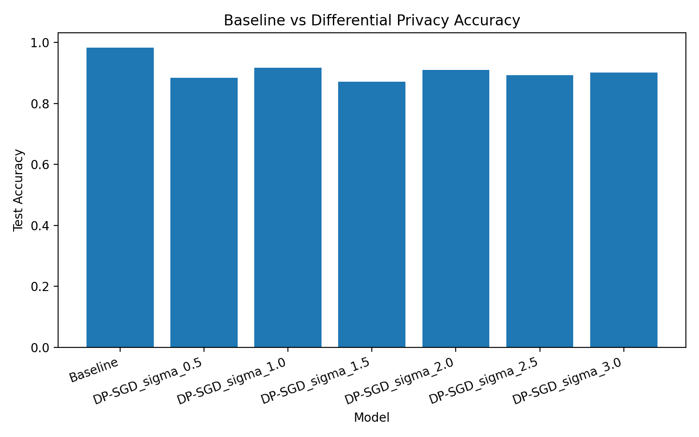
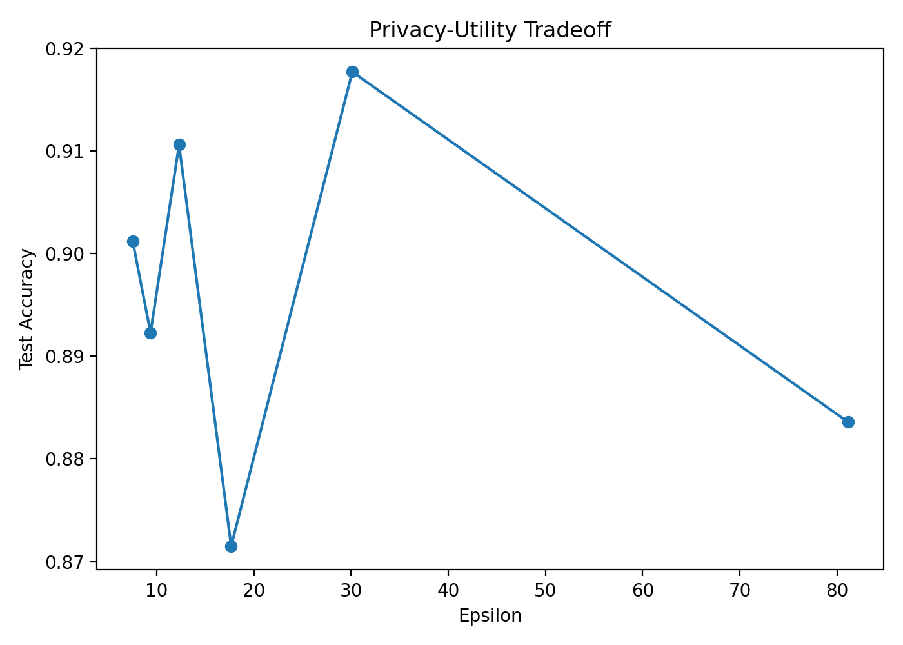

# Deep Learning with Differential Privacy (DP-SGD)

## Course Name: Data Privacy and Security (1142CS5164701)
### Group Name: SecureBytes
Member:
1. Alim Misbullah D11415803	
2. Laina Farsiah D11415802
3. Stenly Ibrahim Adam D11215809
4. Aurelio Naufal Effendy M11415802

## Introduction
With the rapid advancement of machine learning technologies, protecting sensitive data has become a critical concern. Traditional deep learning models require large datasets, which may contain private information. Without proper safeguards, these models may unintentionally expose sensitive data. Differential Privacy (DP) provides a mathematical framework to protect individual data points during training. It ensures that the inclusion or exclusion of a single data sample does not significantly affect the model output. In this project, we implement Differential Privacy in deep learning using the DP-SGD algorithm and evaluate its impact on model performance. This project implements Differential Privacy in Deep Learning using DP-SGD based on the paper: Abadi et al., Deep Learning with Differential Privacy (2016). The experiment evaluates how privacy protection affects model performance using the MNIST dataset. 

## Objectives
* Implement DP-SGD using TensorFlow Privacy
* Compare baseline vs privacy-preserving models
* Analyze privacy-utility tradeoff
* Evaluate privacy using epsilon (ε)

## Methodology
### Dataset
The MNIST dataset was used for this experiment. It consists of:
* 60,000 training images
* 10,000 testing images
* Grayscale images of size 28×28 pixels

### Model Architecture
A Convolutional Neural Network (CNN) was used:
* Conv2D &rarr; ReLU &rarr; MaxPooling
* Conv2D &rarr; ReLU &rarr; MaxPooling
* Flatten
* Dense &rarr; ReLU
* Output layer (10 classes)
The implementation is shown below.
```
# =========================================================
# Model
# =========================================================
def create_model() -> tf.keras.Model:
    """
    Create a small CNN similar to the TensorFlow Privacy tutorial style.
    Final layer has no softmax because we use from_logits=True.
    """
    model = tf.keras.Sequential([
        tf.keras.layers.Input(shape=(28, 28, 1)),
        tf.keras.layers.Conv2D(16, 8, strides=2, padding="same", activation="relu"),
        tf.keras.layers.MaxPool2D(pool_size=2, strides=1),
        tf.keras.layers.Conv2D(32, 4, strides=2, padding="valid", activation="relu"),
        tf.keras.layers.MaxPool2D(pool_size=2, strides=1),
        tf.keras.layers.Flatten(),
        tf.keras.layers.Dense(32, activation="relu"),
        tf.keras.layers.Dense(10)
    ])
    return model
```
The model extracts features using convolutional layers and performs classification using fully connected layers.

### Baseline Training
The baseline model was trained using standard Stochastic Gradient Descent (SGD) without any privacy mechanism. The implementation code is shown below.
```
# =========================================================
# Train baseline
# =========================================================
def train_baseline(x_train, y_train, x_test, y_test) -> Dict:
    """Train a non-private baseline model."""
    print("\n==============================")
    print("Training baseline model")
    print("==============================")

    model = create_model()

    model.compile(
        optimizer=tf.keras.optimizers.SGD(learning_rate=LEARNING_RATE),
        loss=tf.keras.losses.SparseCategoricalCrossentropy(from_logits=True),
        metrics=["accuracy"]
    )

    start_time = time.time()
    history = model.fit(
        x_train, y_train,
        epochs=EPOCHS,
        batch_size=BATCH_SIZE,
        validation_data=(x_test, y_test),
        verbose=2
    )
    train_time = time.time() - start_time

    test_loss, test_acc = model.evaluate(x_test, y_test, verbose=0)


    result = {
        "model": "Baseline",
        "noise_multiplier": 0.0,
        "l2_norm_clip": None,
        "epochs": EPOCHS,
        "batch_size": BATCH_SIZE,
        "delta": DELTA,
        "epsilon": None,
        "privacy_statement": None,
        "test_loss": float(test_loss),
        "test_accuracy": float(test_acc),
        "training_time_sec": round(train_time, 2)
    }

    return result, history.history
```
This serves as a reference for evaluating the impact of Differential Privacy.
### Differential Privacy Implementation
Differential Privacy was implemented using DP-SGD, which modifies training as follows:
* Gradient Clipping &rarr; Each training sample’s gradient is clipped to a fixed L2 norm to limit its influence
* Noise Addition &rarr; Gaussian noise is added to the aggregated gradients
* Privacy Measurement &rarr; Privacy is quantified using 𝜀, where smaller values indicate stronger privacy
```
# =========================================================
# Train DP model
# =========================================================
def train_dp_model(x_train, y_train, x_test, y_test, noise_multiplier: float) -> Dict:
    """
    Train a DP-SGD model.

    Key DP idea:
    - per-example gradients are clipped to L2_NORM_CLIP
    - Gaussian noise is added during optimization
    """
    print("\n==============================")
    print(f"Training DP model | noise_multiplier={noise_multiplier}")
    print("==============================")

    model = create_model()

    # For DP optimizers, use unreduced loss so microbatches/per-example handling works
    loss = tf.keras.losses.SparseCategoricalCrossentropy(
        from_logits=True,
        reduction=tf.keras.losses.Reduction.NONE
    )

    optimizer = DPKerasSGDOptimizer(
        l2_norm_clip=L2_NORM_CLIP,
        noise_multiplier=noise_multiplier,
        num_microbatches=BATCH_SIZE,   # one microbatch per example for simplicity
        learning_rate=LEARNING_RATE
    )

    model.compile(
        optimizer=optimizer,
        loss=loss,
        metrics=["accuracy"]
    )
       start_time = time.time()
    history = model.fit(
        x_train, y_train,
        epochs=EPOCHS,
        batch_size=BATCH_SIZE,
        validation_data=(x_test, y_test),
        verbose=2
    )
    train_time = time.time() - start_time

    test_loss, test_acc = model.evaluate(x_test, y_test, verbose=0)
       
        # Call get_epsilon funtion to get epsion value for different noise multiplier.
        epsilon, statement = get_epsilon(
        num_examples=len(x_train),
        batch_size=BATCH_SIZE,
        noise_multiplier=noise_multiplier,
        epochs=EPOCHS,
        delta=DELTA
    )

    result = {
        "model": f"DP-SGD_sigma_{noise_multiplier}",
        "noise_multiplier": noise_multiplier,
        "l2_norm_clip": L2_NORM_CLIP,
        "epochs": EPOCHS,
        "batch_size": BATCH_SIZE,
        "delta": DELTA,
        "epsilon": epsilon,
        "privacy_statement": statement,
        "test_loss": float(test_loss),
        "test_accuracy": float(test_acc),
        "training_time_sec": round(train_time, 2)
    }

    return result, history.history
```
### Data Perturbation Method
In this experiment, the data is not directly modified. Instead, perturbation is applied during the training process using Differentially Private Stochastic Gradient Descent (DP-SGD). Specifically, the gradient computed from each individual training example is first clipped to a fixed L2 norm to limit its influence. Then, Gaussian noise is added to the aggregated gradients before updating the model parameters. This process effectively hides the contribution of individual data samples, ensuring that the model does not reveal sensitive information about any specific training example. The implementation code is shown in the following.
```
loss = tf.keras.losses.SparseCategoricalCrossentropy(
        from_logits=True,
        reduction=tf.keras.losses.Reduction.NONE
    )
```

### Privacy Measurement (Epsilon)
During training the Data Privacy model, we also compute the epsilon value for each implementation of noise multiplier. The implementation code for computing epsilon is shown below.
```
# =========================================================
# Epsilon computation helper
# =========================================================
def get_epsilon(num_examples: int, batch_size: int, noise_multiplier: float,
                epochs: int, delta: float) -> float:
    """
    Compute epsilon using TensorFlow Privacy helper.

    Official docs expose:
    compute_dp_sgd_privacy(n, batch_size, noise_multiplier, epochs, delta)
    Return both:
    1. numeric epsilon value
    2. full privacy statement
    """
    try:
        statement = compute_dp_sgd_privacy_statement(
            number_of_examples=num_examples,
            batch_size=batch_size,
            num_epochs=epochs,
            noise_multiplier=noise_multiplier,
            delta=delta,
            used_microbatching=True
        )
    except TypeError:
        # fallback for older/newer signatures
        statement = compute_dp_sgd_privacy_statement(
            num_examples,
            batch_size,
            epochs,
            noise_multiplier,
            delta,
            used_microbatching=True
        )

    statement = str(statement)

    # Extract numeric epsilon from the statement
    match = re.search(
        r"Epsilon with each example occurring once per epoch:\s*([0-9.]+)",
        statement
    )

    eps = float(match.group(1)) if match else np.nan

    return eps, statement


```

### Training Configuration
To run the experiment, we use the following configuration
* Epochs: 5
* Batch size: 250
* Learning rate: 0.15
* L2 norm clip: 1.0
* Delta: 10-5
* Noise multipliers: 0.5, 1.0, 1.5, 2.0, 2.5, 3.0

## Results and Discussion
### Performance Comparison

| Model | Noise Multiplier | Test Accuracy | Epsilon | Training Time (s) |
| --- | ---: | ---: | ---: | ---: |
| Baseline | 0.0 | 98.31% | N/A | 9.02 |
| DP-SGD | 0.5 | 88.36% | 81.116 | 156.92 |
| DP-SGD | 1.0 | 91.77% | 30.127 | 187.95 |
| DP-SGD | 1.5 | 87.15% | 17.665 | 192.94 |
| DP-SGD | 2.0 | 91.06% | 12.302 | 197.81 |
| DP-SGD | 2.5 | 89.23% | 9.368 | 196.37 |
| DP-SGD | 3.0 | 90.12% | 7.532 | 196.8 |

The results demonstrate a clear tradeoff between model performance and privacy protection. The baseline model achieved the highest accuracy (98.13%), while DP models achieved 87% - 92% accuracy, showing good performance despite privacy constraints. The best DP performance was achieved at noise multiplier = 1.0. By increasing noise, the epsilon reduces and improves the privacy.

### Key Insight
* Strong privacy can be achieved with minimal accuracy loss
* DP introduces a tradeoff between privacy and performance

## Visualizations
### Accuracy Comparison
Comparison of test accuracy between baseline and DP models.

<p align="center">
  
</p>

### Privacy-Utility Tradeoff
Relationship between epsilon (privacy level) and model accuracy.

<p align="center">
  
</p>

## Setup
### Requirements
```
conda create -n dataprivacy_tf
source activate dataprivacy_tf
pip install -r requirements.txt
```

### Run Experiment
```
python securebytes_hw2_dp_mnist.py
```

### Project Structure
```
results/     → experiment outputs
report/      → final report
```

## Code Implementation Explanation


## Privacy Explanation
### DP-SGD protects training data by:
* clipping gradients to limit individual influence
* adding Gaussian noise to hide data contribution
### Privacy is measured using epsilon (ε):
* smaller ε → stronger privacy

## Environment
* TensorFlow 2.15.1
* TensorFlow Privacy 0.9.0
* CUDA 12.2
* GPU: NVIDIA RTX 2080 Ti

## References
* Abadi et al. (2016)
* TensorFlow Privacy Documentation
* MNIST Dataset
